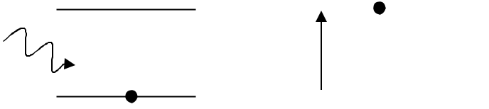
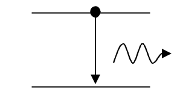

# Introduction
LASER - Light Amplification by Stimulated Emmision of Radiation.

Properties:
- Monochromatic
- Coherent
- Intense
- Directive

## Interaction of radiation with matter
In all these cases we assume energy of lower level to be $\text E_1$ with $\text N_1$ atoms and energy of higher level be $\text E_2$ with $\text N_2$ atoms.

### 1) Induced Absorption / Stimulated Absorption
If a photon of energy $\text h\nu=\text E_2-\text E_1$ travels near an atom in the lower level, the atom can absorb this photon and rise to the higher energy level.

### 2) Spontaneous Emmision
When an atom in the higher level transition to lower level by spontaneously emmiting a photon of energy $\text E_2-\text E_1$ without any stimulus.

Here, the photons are emmited in all possible directions. There is no phase relation between the photons. Thus, the emmited light is incoherent. Number of spontaneous emmisions taking place depends on $\text N_2$ in $\text E_1$.

### 3) Stimulated Emmision
> LASERs arise from this interaction.

When a photon of just right frequency and energy $\text E_2-\text E_1$ passes near an atom and induces an excited atom to make a downward transition, releasing energy in the form of photon.