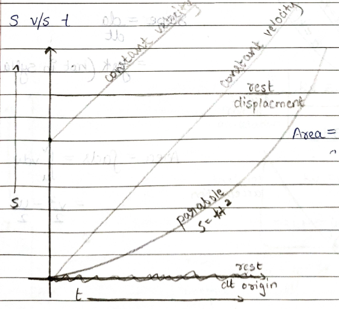
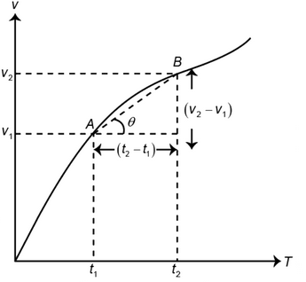
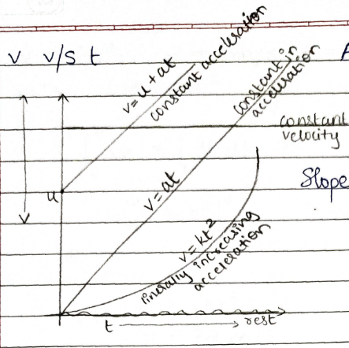
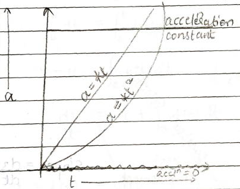
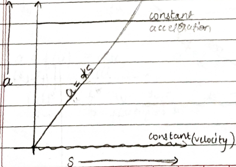
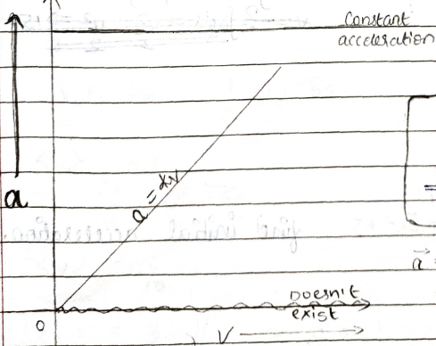
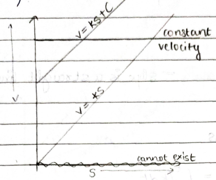

# Average Speed

## For equal intervals of time $(t= t_1 = t_2 \dots t_n)$:

$$
<v_{avg}> = \frac{v_1 +v_2 + \dots v_n}{n} \tag{Aritmethic Mean}

$$

## For equal intervals of Distance $(s= s_1 = s_2 \dots s_n)$:

$$
<v_{avg}> = \frac{n}{\frac{1}{v_1}+\frac{1}{v_2}+\dots \frac{1}{v_n}}\tag{Harmonic Mean}
$$

# Uniform Velocity

- Only possible if body is moving in a straight line without reversing its direction
- $|\text{Uniform Velocity}| = |\text{Uniform Speed}|$

# Graphs

## 1) $s$-$t$ graph

- Slope = $\frac{ds}{dt} = v$
- Area = $\times$ Not Defined
    **Note:** $v_{avg} = \frac{s_2 - s_1}{t_2-t_1} = \tan\theta$ (of line joining the 2 point **NOT** of the curve)
    
****
## 2) $v$-$t$ graph

- Slope = $\frac{dv}{dt} = a$
- Area = $\int_{t_1}^{t_2} vdt = \int_{s_1}^{s_2} ds$

**Note:** $a_{avg} = \frac{v_2 - v_1}{t_2-t_1} = \tan\theta$ (of line joining the 2 point **NOT** of the curve)

***
## 3) $a$-$t$ graph

- Slope = $\frac{da}{dt} = \text{Jerk (Not in Syllaubs)}$
- Area = $\int_{t_1}^{t_2} adt = v-u$
****
## 4) $a$-$s$ graph

- Area = $\int ads = \int_{u}^{v}vdv = \frac{v^2-u^2}{2}$
****
## 5) $a$-$v$ graph

- $a=k\cancel v=\cancel v\frac{dv}{ds}$

$\therefore \int_0^s kds = \int_u^v dv$

$\implies ks=v-u \implies \boxed{v=ks+u}$

* * *

- $a=kv = \frac{dv}{dt}$

$\therefore \int_0^tkdt = \int_u^v \frac{dv}{v}$

$\implies \boxed {kt=\ln\frac{v}{u}}$
****
## 6) $v$-$s$ graph

- $v = ks+c$

$a=v\frac{dv}{ds}$

$a=(ks+c)k ~ \text{where, } k=\frac{dv}{ds}$

$\boxed {a=k^2s + kc}$

* * *

- $v=ks+c=\frac{ds}{dt}$

$\therefore \int_0^s \frac{ds}{ks+c}=\int_0^t dt$

$\implies t=[ln(ks+c)]_0^s$

$\boxed{t=\frac1k\bigg({\ln\frac{ks+c}{c}}\bigg)}$

**Note:** If Velocity displacement curve is a straight line with slope $k$ then acceleration curve will be a straight line with slope $k^2$

## Displacement in $t^{th}$ second of Uniformly Accelerated Motion

* * *

$$
s_{t^{th}} = s_t - s_{t-1}

$$

$$
=\bigg [ut + \frac 12at^2 \bigg] -\bigg [u(t-1) + \frac 12a(t-1)^2 \bigg]

$$

$$
=\bigg [ut + \frac 12at^2 \bigg] -\bigg [ut-u + \frac 12a(t^2 -2t +1) \bigg]

$$

$$
=\cancel{ut}+ \cancel{\frac 12at^2} -\cancel{ut}+u - \cancel{\frac 12at^2} + at -\frac12a)

$$

$$
\boxed{= u+\frac a2\big(2t-1 \big)}

$$
# Motion under Gravity
## for Projectile motion from Origin:
$$
\text{Time of Flight} = \frac{2u}{g}
$$
$$
\text{Maximum Height} = \frac{u^2}{2g}
$$
## Motion when dropped from a Height
$$
S_1:S_2:S_3\dots S_n = 1^2:2^2:3^2\dots n^2 
$$

$$
\Delta x_1:\Delta x_2:\Delta x_3\dots\Delta x_n=1:3:5\dots (2n-1)
$$

# Relative Motion
- For maximum seperation, Relative Velocity = 0
- For maximum relative velocity, Relative Acceleration = 0
