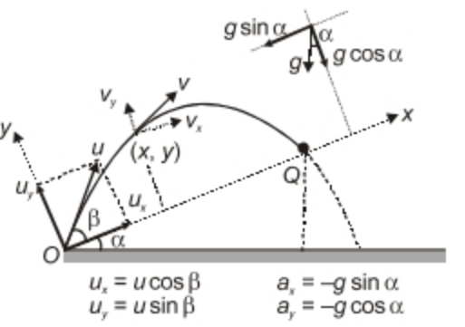

# Projectile Motion

$$
\text{Equation of Trajectory} \implies y = x\tan\theta -\frac{gx^2}{2u^2cos^2\theta} = x\tan\theta\bigg[1-\frac xR\bigg]
$$

$$
\text{Range (R)} = \frac{u^2\sin2\theta}{g}

$$

$$
\text{Time of Flight (T)} = \frac{2u\sin\theta}{g}

$$

$$
\text{Maximum Height (H)} = \frac{u^2\sin^2\theta}{2g} 

$$

$$
\text{Angle of Trajectory }(\phi)\implies\tan\phi = \frac{v_y}{v_x} = \frac{usin\theta - gt}{ucos\theta} = \frac{\sqrt{u^2sin^2\theta - 2gy}}{ucos\theta}

$$

$$
\text{Angle of Inclination }(\alpha)\implies \tan\alpha = \frac yx = \frac{u\sin\theta -\frac 12 gt}{u\cos\theta}

$$
# Projectile on Inclined Plane

$$
u_x = u\cos\alpha

$$

$$
u_y = u\sin\alpha

$$

$$
a_x = -g\sin\theta

$$

$$
a_y = -g\sin\theta

$$

$$
\text{Time of Flight }(T) = \frac{2u\sin\alpha}{g\cos\theta}

$$

$$
\text{Range }(R) = \frac{2u^2\sin\alpha\cos(\alpha+\theta)}{g\cos^2\theta}

$$

**Note:** Range is maximum when $\theta + 2\alpha = \Large{\frac{\pi}{2}}$

$$
\therefore R_{max}\text{ (When thrown \textbf{UP} the plane) } \bigg[\beta = \frac\pi4-\frac \alpha2\bigg]= \frac{u^2}{g(1+\sin\alpha)}
$$
$$
\therefore R_{max}\text{ (When thrown \textbf{DOWN} the plane) } \bigg[\beta = \frac\pi4+\frac \alpha2\bigg]= \frac{u^2}{g(1-\sin\alpha)}
t

**Note:** Projectile must be projected along the **angle bisector** of $\pmb{\alpha}$ and $\pmb{\theta}$ to have $\bold{R_{max}}$