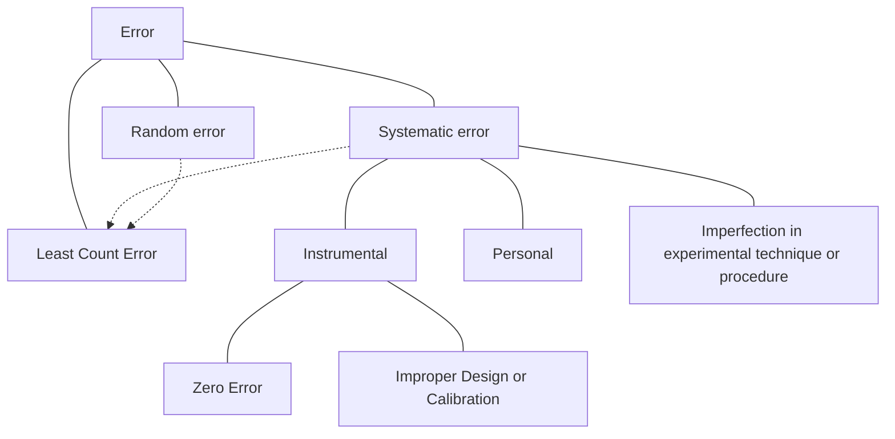

# Fundamental Forces
1) Gravitational Force:
2) Electromagnetic Force
3) Strong Nuclear Force:
	- Force between Protons & Neutrons (Not Experienced by Electrons)
	- Extremely short ranged $(\approx 10^{-15}\text m)$
	- Does not depen**strong text**d upon charge
	- Strongest Fundamental Force $(\approx 100\times \text{Electromagnetic force})$
4) Weak Nuclear Force
	- Extremely Short Ranged $(\approx 10^{-16}\text m)$
	- Appears in some nuclear processes such as $\beta-\text{Decay}$
$$
\boxed{\text{Gravitational} <\text{Weak Nuclear} <\text{Electromagnetic} <\text{Strong Nuclear}}
$$
# Conservation Laws
In an Ideal Isolated System, in absence of external force:
- Law of Conservation of **Mass**
- Law of Conservation of **Energy**
- Law of Conservation of **Charge**
- Law of Conservation of **Momentum**
- Law of Conservation of **Angular Momentum**

# Dimensional Analysis
- $A +B$ and $A-B \iff$ $A$ & $B$ have same dimensions
- $A=B$ when dimensions on $LHS=RHS$

**Note:** A Dimensionally correct equation may not be correct Physically

# Errors

# Calculation of Errors
- Arithmetic Mean is considred to be the most accurate value.
$$
\therefore a_{mean} = \frac{a_1 + a_2 + a_3 +\dots a_n}{n} =\text{True Value}
$$
Then, 

$\text{Absolute Error} = |{\Delta{a_n}}| = |{{a_n} - a_{mean}}|$

$\text{Mean Absolute Error} = \frac{|{\Delta{a_1}}| + |{\Delta{a_2}}| + \dots |{\Delta{a_n}}| }{n}= |\Delta a_{mean}|$

$\text{Relative Error} =\frac{{\Delta{a_{mean}}}} {a_{mean}}$

$\text{Percentage Error} = \text{Relative Error} \times 100 =\frac{{\Delta{a_{mean}}}} {a_{mean}} \times 100$

# Combination of Errors

- for Addition & Subtraction $\implies \Delta x = \Delta a+\Delta b$ 
- for Multplication & Division $\implies \frac{\Delta y}{y} = \frac{\Delta a}{a}+\frac{\Delta b}{b}$ 
- for Powers & Exponents $\implies \frac{\Delta z}{z} = \frac{m\Delta a}{a}+\frac{n\Delta b}{b}$

where:
$x=a+b$
$y=\frac ab$
$z=\frac {a^m}{b^n}$
**Note:** In most cases, Least Count is the error

# Significant Figures
- Trailing zeroes without a decimal point are insignificant
**e.g.** 2304000 has 4 significant figures
- Trailing zeroes with a decimal point are significant
**e.g.** 306.800 has 6 significant figures
- If a number is less than 1, zeroes to the left of the non-zero no. are insignificant.
**e.g.** 0.0000123 has 3 significant figures
- For scientific notation $(a \times 10^b)$
	- All numbers in $a$ are significant
	- The value of $b$ is irrelevant
**e.g.** 3.560 m = 3.560 x 10^-3^ km = 3.560 x10^2^ cm **all have 4 significant figures**

**Note:** Exact numbers appearing in formulae have infinite significant figures.
# Arithmetic Operations on Significant Figures
- For Addition & Subtraction, the final result will have the same number of decimal places as the no. with the least decimal places
**e.g.** $7.37 + 6.63+4=18$
- For Multiplication & Division, the final result will have the same number of significant figures as  the no. with the least significant figures.
**e.g.** $4.11/1.2=3.4$
# Rounding off Uncertain Digits
Let the number to be rounded up be $x$
- if $x>5$ we round up
- if $x<5$ we round down
- if $x=5$:
	- Round up if preceeding digit is **odd**
	- Leave unchanged if preceeding digit is **even**