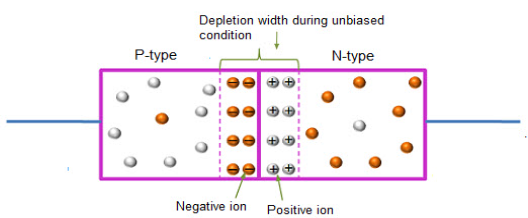

# Diodes
- Two-terminal unilateral device which allows the flow of current in only one direction
- Formed by Joining 2 p-type and n-type semiconductors to each other. 
- Can be biased (application of voltage) in 2 ways:
	- Forward Bias: Positive to Negative Terminal -> Low Resistance -> Current Flows
	- Reverse Bias: Negative to Positive Terminal -> High Resistance -> Current Blocked

- Potential diference accross depletion region is called barrier potential / junction potential / built-in voltage / cut-in potential.
- Net Current in unbiased diode is 0.
## Forward Biased Diode:
- Postive terminal of battery is connected to p region of diode and Negative Terminal of the battery is connected to n region of diode.
- Electrons travel from Negative terminal of the battery to the diode where it will only cross the barrier if applied potential is greater than the barrier potential:
	- Barrier Potential for Si: 0.7V
	- barrier Potential for Ge: 0.3V
- due to this width of the barrier reduces and 

# Rectifiers

## Half-Wave Rectifier

- Only one half of the input is converted while the other is lost.

### &lt;image: Circuit Diagram&gt;

$\text{Turns Ratio }= N_1:N_2 = 240:12=\underline{20:1}$ (TO VERIFY)

### &lt;image: Original Wave Diagram (Input)&gt;

### &lt;image: Rectified Wave Diagram (Output)&gt;

**Note:** The output produced is not DC. It is a **pulsating** DC

### Operation

1.  During $+\text{ve}$ cycle: Diode is **on** and it conducts through $R_L$
2.  During $-\text{ve}$ cycle: Diode is **off** and Output $=0$

### Ripple Factor $(\gamma)$

- Denoted by $\gamma$ (gamma)
- It is used to represent the amount of AC present in the rectified AC output
- For Half-Wave Rectifier its value is $1.21$ (Standard for all apparatus)
- Whereas, for Full-Wave Rectifier its value is $0.483$

### Capacitive Filtering (Smoothing / Reservoir Circuit)

### &lt;image of circuit diagram&gt;

- Improvement in Half wave rectifier circuit is possible by adding a capacitor C to ensure that the output voltage remains at / near the peak value even when the diode is not conducting.
- To ensure this, the capacitor value is chose such that it changes to the peak very fast and discharges very slowly during the entire period when the diode is not conducting
- The capacitor is referred to as reservoir as it stores charge during $+\text{ve} \ 1/2$ cycle and discharges during $-\text{ve} \ 1/2$ cycle.
- The reservoir circuit ensures that the ripples present in the rectifier output is reduced significantly.

The amount of ripples produced $=\frac{\text{V}_\text{ripple (o/p)}}{\text{V}_\text{ripple (i/p)}}\approx \frac{X_C}{\sqrt{R^2+X_C^2}}$

### &lt;image of wave diagram&gt;

## Full Wave Rectifier

### 1) Bi-phase / Centre-Tapped

### &lt;image of circuit diagram&gt;

- Uses 2 Diodes
- Based on center-tapping the secondary transformer.
- Each individual diode acts as a half-wave rectifier with a 1/2 cycle phase difference with same frequency and magnitude as they are center-tapped

Note: Ratios will change if centre-tapping is disturbed

### &lt;waveform_diagram.jpg&gt;

- They have the same frequency, magnitude but opposite polarity.

### 2) Bridge

### &lt;image of circuit diagram&gt;

- Uses 4 Diodes connected similarly to a wheatstone bridge.

#### During +ve cycle:

- D1 & D2 $\longrightarrow$ On
- D3 & D4 $\longrightarrow$ Off
- $\therefore$ Connection path: A$\rightarrow$B$\rightarrow$C$\rightarrow$E$\rightarrow$D$\rightarrow$F

### &lt;image of wave diagram&gt;

#### During -ve cycle:

- D1 & D2 $\longrightarrow$ Off
- D3 & D4 $\longrightarrow$ On
- $\therefore$ Connection path: A$\rightarrow$B$\rightarrow$E$\rightarrow$C$\rightarrow$D$\rightarrow$F

### &lt;image of wave diagrams: 3 total&gt;

# Transistors (Transfer Resistor / Amplifiers)

- Formed by sandwiching 3 layers of semi-conductors (npn or pnp)
- Bipolar \[Both majority and minority carriers used for conduction\]
- 3 Terminal Device
    - Emitter (E)
    - Base (B)
    - Collector (C)
- It is capable of transferring variable resistance through it.
- npn transistors are preferred as they have a higher conductivity due to majority carriers being e\-s

Symbolic Representations:  

## Biasing of Transistors (Transistor Configuration)

- One of the terminals is made common b/w input and output region
- Common terminal is always grounded (WHY?)
- Common Emitter is the most used configuration (higher gain + stable)

### Common Base

- Has a high gain but is too unstable for practical use.

### Common Emitter

- Highest gain (when compared to other 2 configurations)
- Stable

#### 1) Active Mode / Region

### Common Collector

- A.K.A. Follower Circuit

# Operational Amplifiers (OpAm)

- Non-Inverting Input is always pin #3

## Nomenclature of Operational Amplifiers:

$$
\underbrace{\text{LM}}_{\text{manufacturer}}-741
$$

Here,  
$\text{LM}$ = manufacturer  
$7$ = no. of functional pins (1 is grounded meaning 8 pins total out which 7 are functional)  
$4$ = no of input pins  
$1$ = no of output pins

## Parameters of Operational Amplifiers

### Voltage Gain (Av)

$$
\text A_\text v = \frac{\text V_{\text{o/p}}}{\text V_{\text{i/p}}}
$$

- **Feedback:** is when a small part of o/p is reused in the i/p.
- Open-Loop means no feedback.
- Closed-Loop means feedback is provided.

#### Power Gain

We know, $\text{P = VI}$

$$
\therefore A_P = \frac{P_\text{o/p}}{P_\text{i/p}} = \frac{(VI)_\text{o/p}}{(VI)_\text{i/p}}
$$

In Decibels (dB):

$$
A_P(dB) = 10\log_{10}\frac{P_\text{o/p}}{P_\text{i/p}}
$$

### I/P Resistance

- Refers to Device Resistance

$$
\text{R}_{\text{i/p}} = \frac{\text V_\text{i/p}}{\text I_\text{i/p}}
\\
\
\\
\text{R}_{\text{o/p}} = \frac{\text V_\text{o/p}\text{ (O.C)}}{\text I_\text{o/p}\text{ (S.C)}}
$$

### I/P Offset Voltage

- When applying same value of $V_\text{i/p}$ at both the terminals the ideal $\text{o/p}$ should be $0$, however, in practicality, this is not the case and for this we introduce an offset voltage to make it zero.
- Therefore, Offset is applied when $\text V_\text{o/p} =\text V_\text{inv}-\text V_\text{Non-inv} \neq 0$
- Offset can be both $\text{+ve}$ and $\text{-ve}$ and we can have both at the same time.
    - The net is the sum of the two.

### Slew Rate

- Basically, how fast the o/p changes with respect to a small change in i/p
- It is the max rate of change of $\text V_\text{o/p}$ with time in response to $\text{i/p}$

$$
\text{S.R.} = \frac{\Delta \text V_\text{o/p}}{\Delta t}
$$

## Ideal vs Practical Characteristics

| Parameter | Ideal | Practical |
| :---: | :---: | :---: |
| Voltage Gain ($\text A_\text v$) | $\infty$ | $(1-2)\times10^5 \ \text M\Omega$ |
| Input Resistance | $\infty$ | $100\ \text M \Omega$ |
| O/P Resistance | $0$ | $10-100$ $\Omega$ |
| Bandwidth | $\infty$ | $2\ \text{MHz}$ |
| Slew Rate | $\infty$ | $10 \ \text{V/}\mu \text s$ |
| I/P Offset | $0$ | $<5\text{ mV}$ |

## OPAM Circuits

### 1) Inverting Amplifier

$V_{out} =- \frac{R_f}{R_I}V_{In}$

$\therefore A_V =-\frac{R_f}{R_I}$  
Here, $R_f\longrightarrow\text{Feedback Resistance}$  
And, $R_i\longrightarrow\text{Input Resistance}$

### 2) Non-Inverting Amplifier

$V_\text{out} = V_\text{in}\bigg(1+\frac{R_f}{R_I}\bigg)$  
$\therefore A_\text V=\bigg(1+\frac{R_f}{R_I}\bigg)$

- therefore, minimum $A_\text v = 1$ when $\frac{R_f}{R_I} = 0$
- Such cases are called voltage follower (buffer)
- $A_V=1\longrightarrow V_{Input} = V_{output}$